Test for GSOC 2019 - Parallel Coordinate Plot
================
Yawei Ge
4/5/2019

Overview 
========================================================================================

This is a set of tests for GSOC 2019. I'm trying to produce parallel coordinate plots in differnt ways.

Medium and Hard Test - To write a function that can draw parallel coordinate plot and include jittering
=======================================================================================================

Installation
============

The package can be downloaded from GitHub. You can use the following code to install.

``` r
devtools::install_github("yaweige/yaweitest")
```

You can then load the package in the normal way.

``` r
library(yaweitest)
library(tidyverse)
```

Function
========

### `myparallel`

The `myparallel` function was used to produce parallel coordinate plot based on ggplot2 functionalities.

The function has six input values currently and two input values to be extended in the future.

-   `data`: the data.frame to plot
-   `columns`: a vector of variables (either names or indices) to be axes in the plot
-   `groupColumn`: a single variable to group (color) by
-   `jitter`: a single logical value, jitter the points of the selected varaible(s) or not
-   `jittervariables`: varibles that will be jittered, should be a subset of columns, both indices or names; if unspecified, all of the variables will be jittered
-   `jitterratio`: the ratio of the maximum random ajustment devided by the range of selected variables (after scaling)
-   `mapping`: NOT AVAILABLE NOW, aes string to pass to ggplot2 object
-   `...`: NOT AVAILABLE NOW, passed on directly to all of the ggplot2 commands

The function returns a ggplot2 object that can be plotted directly or used as base layers for additional modification

Examples
========

Default
-------

``` r
data(diamonds, package="ggplot2")
diamonds.samp <- diamonds[sample(1:dim(diamonds)[1], 100), ]

myparallel(data = diamonds.samp, columns = c(1, 5:7))
```

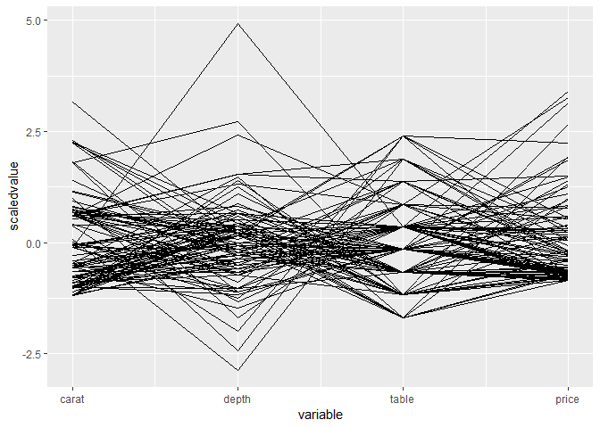

Add Color
---------

``` r
myparallel(data = diamonds.samp, columns = c(1, 5:7), groupColumn = "cut")
```

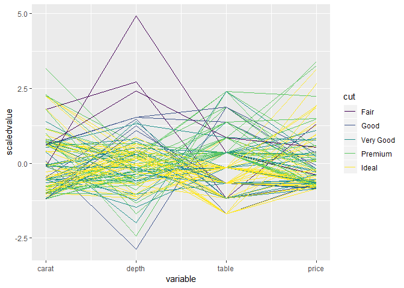

Jitter and Title
----------------

``` r
myparallel(data = diamonds.samp, columns = c(1, 5:7), groupColumn = "cut",
           jitter = TRUE, jittervariables = "table") +
  ggplot2::ggtitle("Hello Parallel")
```

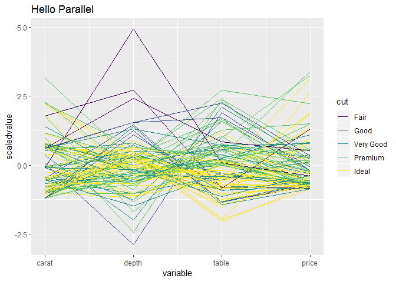

Inelegant Facet
---------------

``` r
myparallel(data = diamonds.samp, columns = c(1, 5:7), groupColumn = "cut",
           jitter = TRUE, jittervariables = "table") +
  ggplot2::facet_wrap(~cut) +
  ggplot2::ggtitle("Hello Parallel")
```

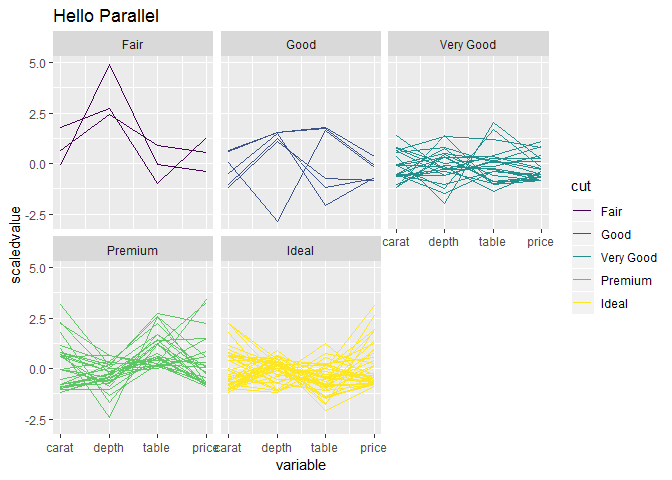

Easy Test - To produce examples using `ggparcoord` and `ggparallel`
===================================================================

Conclusion Comes First
----------------------

To conclude, there are some features of these two functions I think are superfluous, but it doesn't affect anything if you choose not to use them. It's obvious that we can't combine categorical and numerical varibles in one plot using these two funcions. And there are definitely limitations for the full use of `ggplot2` functionalities. Especially, for `ggparallel`, there are more limitations as shown below. But `ggparcoord` works pretty good to my point of view. It is also limited in jittering (but we can do that).

In many aspects, I think they work quite well.

I found that `ggparcoord` does work with facet, but it just simply divided the data instead of calculate for each of facet (or this is not a bad thing?). And `ggparcoord` does work with layers, but it is not very clear what kind of data and aes it passes to the following layers. But it seems not too bad. We can even find a way to jitter using `ggparcoord`.

I didn't see overlapping problem when I deal with categorical variables using `ggparallel`. When it comes to `ggparcoord`, I don't understand the conceptual problem described in the wiki, why treating those "variables of axes" as ordinal variables will lead to overplotting. To me, overlapping just exists because of the data.

Generate Example Data (It's a big one, carefully designed)
----------------------------------------------------------

``` r
set.seed(20190404) # it doesn't really matter
parallelsample <- data.frame(# category_1 is the standard one
                             category_1 = c(rep(letters[1:5], each = 20)),
                             # category_2 is highly correlated with category_1
                             category_2 = c(sample(c(rep("A", 15), sample(LETTERS[2:5], 5, replace = T)), 20), 
                                            sample(c(rep("B", 15), sample(LETTERS[c(1, 3:5)], 5, replace = T)), 20),
                                            sample(c(rep("C", 15), sample(LETTERS[c(1:2, 4:5)], 5, replace = T)), 20),
                                            sample(c(rep("D", 15), sample(LETTERS[c(1:3, 5)], 5, replace = T)), 20),
                                            sample(c(rep("E", 15), sample(LETTERS[1:4], 5, replace = T)), 20)),
                             # category_3 has large difference in the sample sizes of each type
                             category_3 = c(rep("cat", 10), rep("dog", 50), rep("pig", 40)),
                             # category_4 is randomized
                             category_4 = c(sample(rep(c("red", "green", "yellow", "blue"), each = 25), 100)),
                             # numeric_1 is uniformly distributed with different means, correlated with category_1            
                             numeric_1 = c(unlist(lapply(list(0, 5, 10, 15, 20), 
                                                         FUN = function(x) runif(20, min = x, max = x +10)))),
                             # numeric_2 is normally distributed with different means, correlated with numeric_1
                             numeric_2 = c(unlist(lapply(list(5, 10, 15, 20, 25), 
                                                         FUN = function(x) rnorm(20, mean = x, sd = 5)))),
                             # numeric_3 is normally distributed with different means and variances, negatively correlated with numeric_1
                             numeric_3 = c(unlist(lapply(list(-5, -10, -15, -20, -25), 
                                                         FUN = function(x) rnorm(20, mean = x, sd = 1 + sqrt(-x))))),
                             # numeric_4 has a lot of overlap points, correlated with numeric_1
                             numeric_4 = rep(runif(10, min = 0, max = 1), each = 10),
                             # numeric_5 has a lot of overlap points too (but with different pattern, randomized)
                             numeric_5 = sample(rep(runif(10, min = 0, max = 1), each = 10), 100))

str(parallelsample)
```

    ## 'data.frame':    100 obs. of  9 variables:
    ##  $ category_1: Factor w/ 5 levels "a","b","c","d",..: 1 1 1 1 1 1 1 1 1 1 ...
    ##  $ category_2: Factor w/ 5 levels "A","B","C","D",..: 1 3 1 1 1 1 1 4 1 2 ...
    ##  $ category_3: Factor w/ 3 levels "cat","dog","pig": 1 1 1 1 1 1 1 1 1 1 ...
    ##  $ category_4: Factor w/ 4 levels "blue","green",..: 4 2 2 4 1 3 3 4 4 1 ...
    ##  $ numeric_1 : num  1.18 2.39 7.25 1.28 7.71 ...
    ##  $ numeric_2 : num  0.577 -8.238 3.358 -3.282 9.952 ...
    ##  $ numeric_3 : num  -1.65 -7.92 -2.29 -2.57 -3.73 ...
    ##  $ numeric_4 : num  0.0275 0.0275 0.0275 0.0275 0.0275 ...
    ##  $ numeric_5 : num  0.043 0.7421 0.7421 0.0187 0.4619 ...

Features of `ggparcoord`
------------------------

-   work with numeric variables (coerce categorical variables into numeric ones)
-   different way of scale
-   handle missing value (kind of superfluous, leave that to the users)
-   support spline fit
-   boxplot backgroud (messy, not recommended)
-   suggest ways to order the varibles (kind of superfluous, leave that to the users)

Examples For `ggparcoord`
-------------------------

### `std` scale as default, subtract mean and divide by standard devition

``` r
library(GGally)
```

    ## 
    ## Attaching package: 'GGally'

    ## The following object is masked from 'package:dplyr':
    ## 
    ##     nasa

``` r
ggparcoord(parallelsample, columns= 5:9)
```

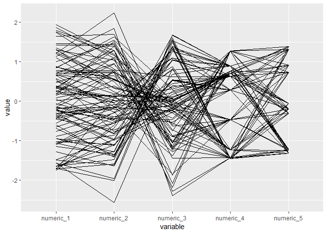

### Add some color

``` r
ggparcoord(parallelsample, columns= 5:9, groupColumn = 1)
```

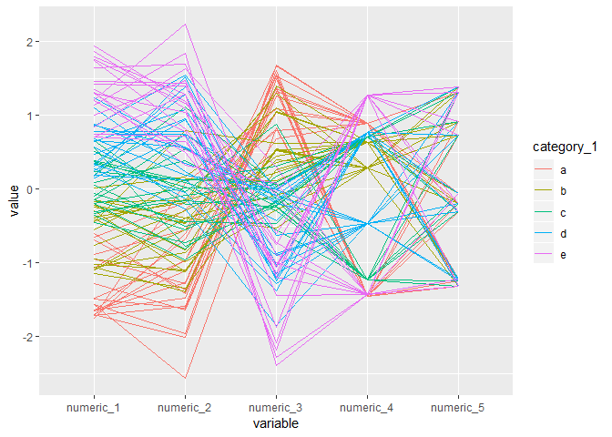

### `uniminmax` scale

``` r
ggparcoord(parallelsample, columns= 5:9, groupColumn = 1, scale = "uniminmax")
```

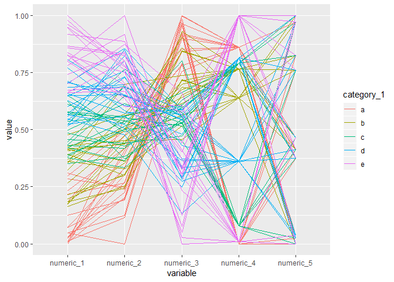

### `uniminmax` scale, centered by "mean"

``` r
ggparcoord(parallelsample, columns= 5:9, groupColumn = 1, scale = "center")
```

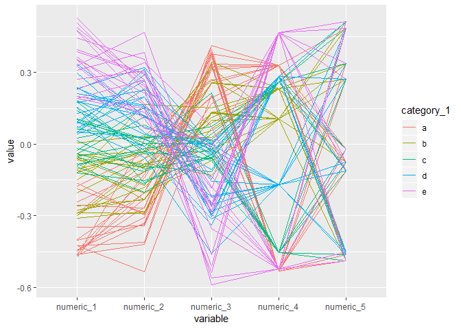

### `globalminmax`, unscaled; with some transparency

``` r
ggparcoord(parallelsample, columns= 5:9, groupColumn = 1, scale = "globalminmax", alphaLines = 0.5)
```


### Spline fit

``` r
ggparcoord(parallelsample, columns= 5:9, groupColumn = 1, splineFactor = T)
```

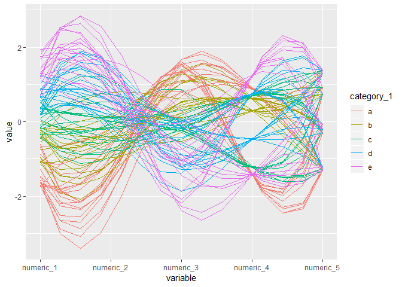

### Method to order the varibles(axes)

``` r
ggparcoord(parallelsample, columns= 5:9, groupColumn = 1, order = "anyClass")
```

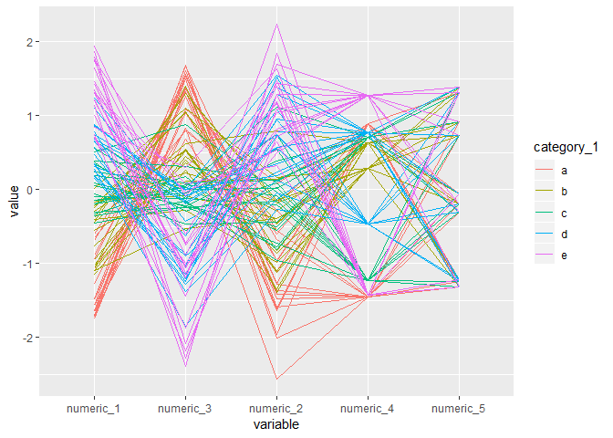

More On `ggparcoord`
--------------------

### Work with `facet_wrap`, add title

``` r
ggparcoord(parallelsample, columns= 5:9, groupColumn = 3,
           scale = "uniminmax") + 
  facet_wrap(~category_3) +
  ggtitle("Happy Parallel")
```


### Interesting finding, add points in this way

``` r
ggparcoord(parallelsample, columns= 5:9, groupColumn = 1) + 
  geom_point()
```

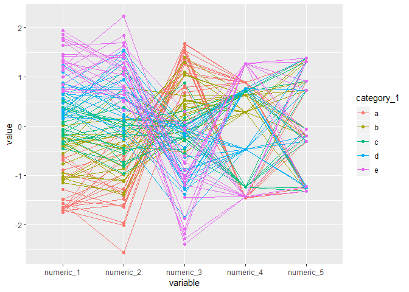

``` r
ggparcoord(parallelsample, columns= 5:9, groupColumn = 1) + 
  geom_jitter()
```

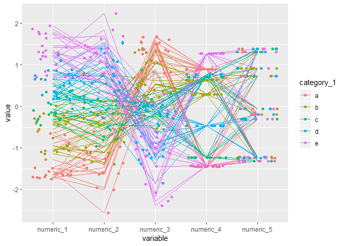

### We can jitter in this way!!! But all the variables are jittered!!!

``` r
ggparcoord(parallelsample, columns= 5:9, groupColumn = 1, alphaLines = 0) +
  geom_line(position = position_jitter(width = 0, height = 0.4))
```


Pretty good!!!
==============

Noticed that our category\_1 is already a factor varible, we still need to use factor(category\_1) to make it a categorical variable here.

``` r
ggparcoord(parallelsample, columns= 5:9,  alphaLines = 0.5,
           mapping = aes(color = category_1, size = category_2)) + 
  scale_size_identity() +
  ggtitle("Happy Parallel") +
  theme_light() +
  theme(plot.title = element_text(hjust = 0.5))
```

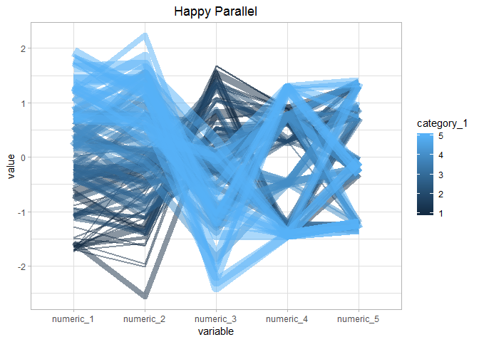

Features of `ggparallel`
------------------------

-   work with categorical variables
-   different types of parallel coodinate plots: common angle, adj common angle, hammock, parset
-   ajustable label
-   arranged order of levels with in each categorical variable somehow (see category\_2 and 3 in examples below, leave that to the users)

Examples for `ggparallel`
-------------------------

### Work with categorical variblaes in default, method = "angle"

``` r
library(ggparallel)
ggparallel(data = parallelsample, vars = list("category_1", "category_2", "category_3", "category_4"))
```


### Hammock plot, surprise!!!

``` r
ggparallel(data = parallelsample, 
           vars = list("category_1", "category_2", "category_3", "category_4"),
           method = "hammock")
```

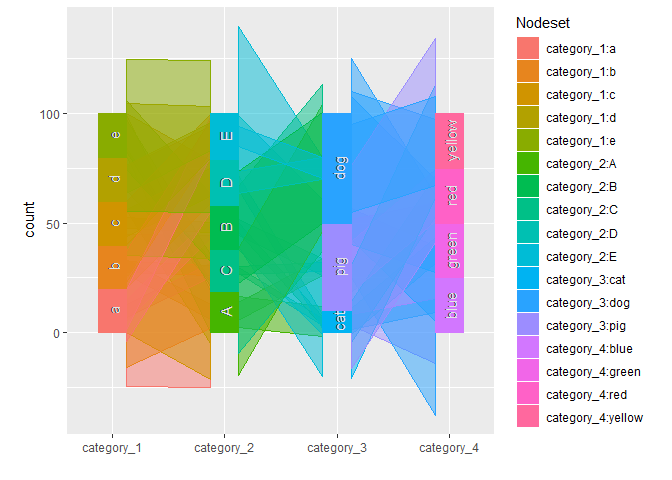

### Hammock plot, ajusted

``` r
ggparallel(data = parallelsample, 
           vars = list("category_1", "category_2", "category_3", "category_4"),
           method = "hammock", ratio = 0.2)
```

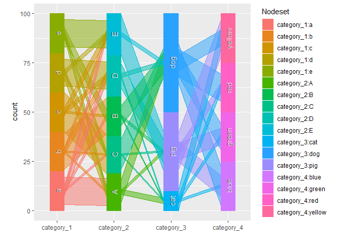

### Parset plot

``` r
ggparallel(data = parallelsample, 
           vars = list("category_1", "category_2", "category_3", "category_4"),
           method = "parset")
```

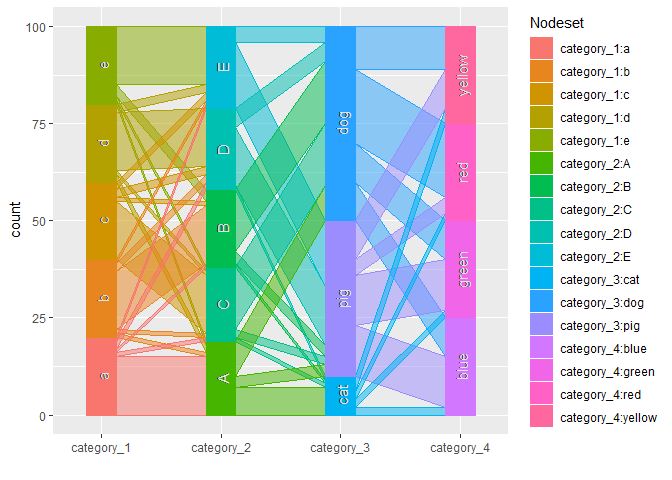

### Parset plot with adjusted labels

``` r
ggparallel(data = parallelsample, 
           vars = list("category_1", "category_2", "category_3", "category_4"),
           method = "parset", text.angle = 0)
```


More On `ggparallel`
--------------------

### This works in a strange way

``` r
ggparallel(data = parallelsample, 
           vars = list("category_1", "category_2", "category_4")) +
  facet_wrap(~category_1)
```

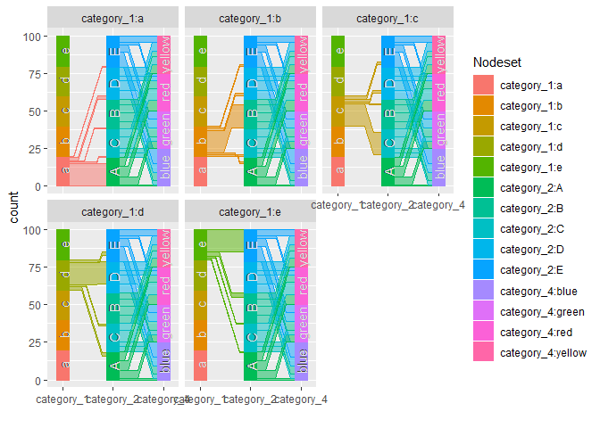

Doesn't work
============

``` r
ggparallel(data = parallelsample,
           vars = list("category_1", "category_2", "category_4")) +
  facet_wrap(~category_3)
```

Doesn't work
============

``` r
ggparallel(data = parallelsample, 
           vars = list("category_1", "category_2", "category_4"),
           mapping = aes(alpha = as.numeric(category_3)/5))
```

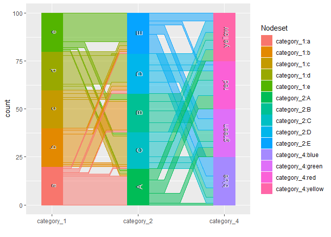

Doesn't work
============

``` r
ggparallel(data = parallelsample, 
           vars = list("category_1", "category_2", "category_4"),
           mapping = aes(color = category_3))
```


